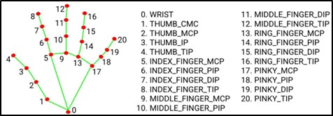
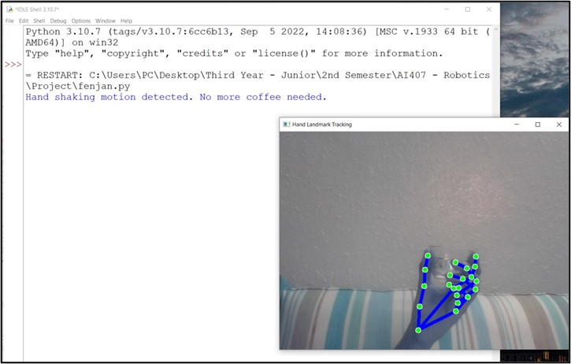
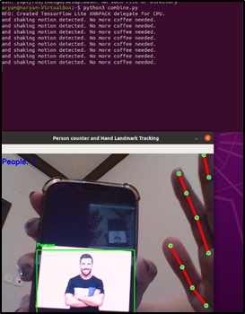

# Bayan-Robot
Bayan is a robot developed by University of Prince Mugrin students. It is mainly programmed to host the guests by pouring coffee to them by detecting hand landmarks. It also has the function to count number of people showing in frame.

In this project 	computer vision and machine learning techniques were used to perform two tasks: hand landmark tracking and person counting.

	Hand Landmark Tracking:

	It uses the MediaPipe library to detect and track hand landmarks in real-time using the webcam feed.

	The hand landmarks include the coordinates of thumb, index, and middle fingertips.

	The distances between these landmarks are calculated to determine if a wave gesture is detected.

	If the distances fall below a certain threshold and are sustained for a certain number of frames, a wave gesture is recognized, and a message is printed.

	Person Counting:

	It utilizes the YOLO model to perform object detection on each frame of the webcam feed.

	The YOLO model is pre-trained on the COCO dataset and is capable of detecting various objects, including persons.

	The detected objects are filtered to only consider the person class.

	Bounding boxes are drawn around the detected persons, and the count of the number of people is displayed on the frame.

